# Muhammad Haiqal Aiman - Updated Portfolio Content

## 1. Hero Section

- **Headline:** Muhammad Haiqal Aiman Bin Mohd Hasly [cite: 1, 2]
- **Sub-headline:** Software Developer | Full Stack Developer [cite: 3]
- **Location & Contact:** Kuala Lumpur [cite: 4] | haiqalhasly@gmail.com | Github: haiqalhasly | Linkedin: Haiqal Aiman [cite: 5]
- **Brief Intro:** Motivated Computer Science undergraduate at Universiti Teknologi Petronas [cite: 7]. Skilled in full-stack development, cloud platforms, and machine learning [cite: 8].

## 2. Education

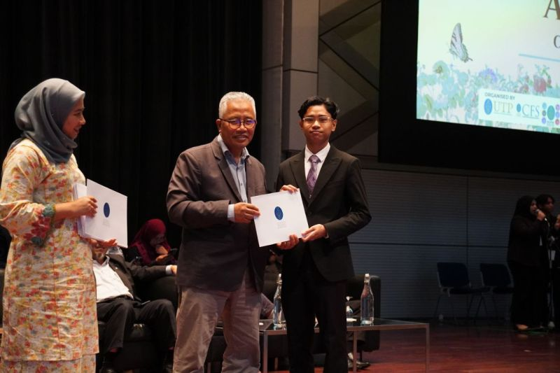

- **Universiti Teknologi Petronas (UTP)** [cite: 15]
  - Bachelor of Computer Science (Hons) with Minor in Corporate Management (Sept 2024 - Expected Dec 2027) [cite: 15, 25]
  - CGPA: 3.81 [cite: 16] | Dean's List: 4 Semesters [cite: 17]
- **Foundation of Science in Computer Science (UTP)** [cite: 18, 19]
  - September 2023 - August 2024 [cite: 20]
  - CGPA: 3.92 [cite: 21] | Dean's List: 3 Semesters [cite: 22]

## 3. Skills & Tools

- **Programming Languages:** Python, SQL, Visual Basic (VB.NET), Flutter, Dart, JavaScript, HTML, CSS [cite: 10]
- **Tools & Cloud:** Git, GitHub, AWS, N8N [cite: 11]
- **Libraries:** Pandas, NumPy, Tensorflow, Flask, OpenCV, YOLO [cite: 11]
- **Core Competencies:** Leadership, Event Management, Strategic Planning, Problem Solving, Public Speaking [cite: 13]

## 4. Featured Projects

- **University AI Chatbot and Navigation System** (Nov 2025) [cite: 24]
  - Developed an intelligent RAG-based knowledge system using N8N and Google Gemini, integrating session memory [cite: 27].
  - Deployed a pathfinding API using Python and Flask on Railway.app with the A\* search algorithm [cite: 28].
- **Fullstack Crowd Monitoring and Prediction System** (Sept 2025) [cite: 29]
  - 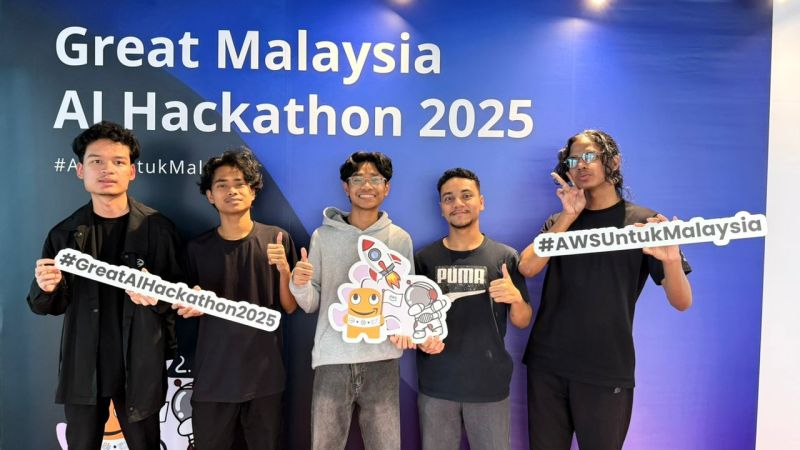
  - Architected a full-stack system tracking real-time occupancy across 5 venue zones [cite: 30].
  - Engineered a predictive forecasting engine using DeepAR time-series models [cite: 31].
- **AI Deepfake Detection** (Sept 2025) [cite: 56, 57]
  - 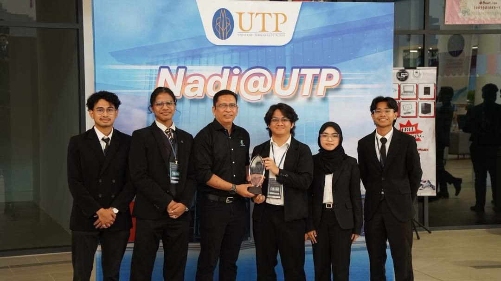
  - Co-developed a dual analysis system utilizing Gemini AI transcript analysis (60% weightage) and Sightengine visual analysis (40% weightage) [cite: 58, 59].
- **Skin Disease Detection** (June - July 2025) [cite: 33, 34, 35]
  - 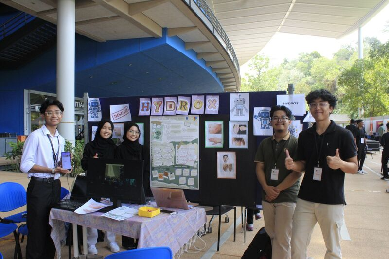
  - Trained a custom model on 1000+ images using YOLO and Roboflow [cite: 37].
  - Implemented real-time disease detection from a webcam feed using Python and OpenCV [cite: 38].
- **Full Stack Food Delivery App** (July 2025) [cite: 40, 41]
  - 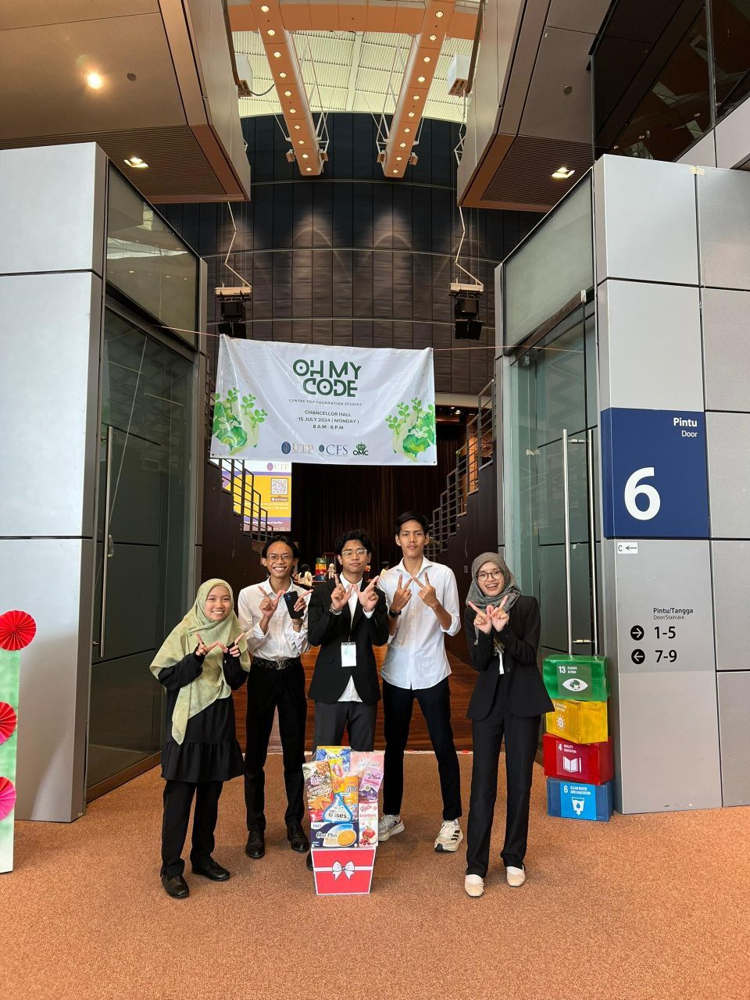
  - Led end-to-end development of the front-end and back-end logic using Visual Basic [cite: 42, 43, 45].

## 5. Experience & Leadership

- **Head of Department @ AI Ready Asean** (Jan 2024 - Nov 2024) [cite: 70, 71]
  - Trained 50+ students with hands-on AI applications like NotebookLM and Google Teachable Machine [cite: 72].
- **Assistant Head of Department @ Google Developer Student Club - UTP** (Sept 2024 - Present) [cite: 62, 63]
  - 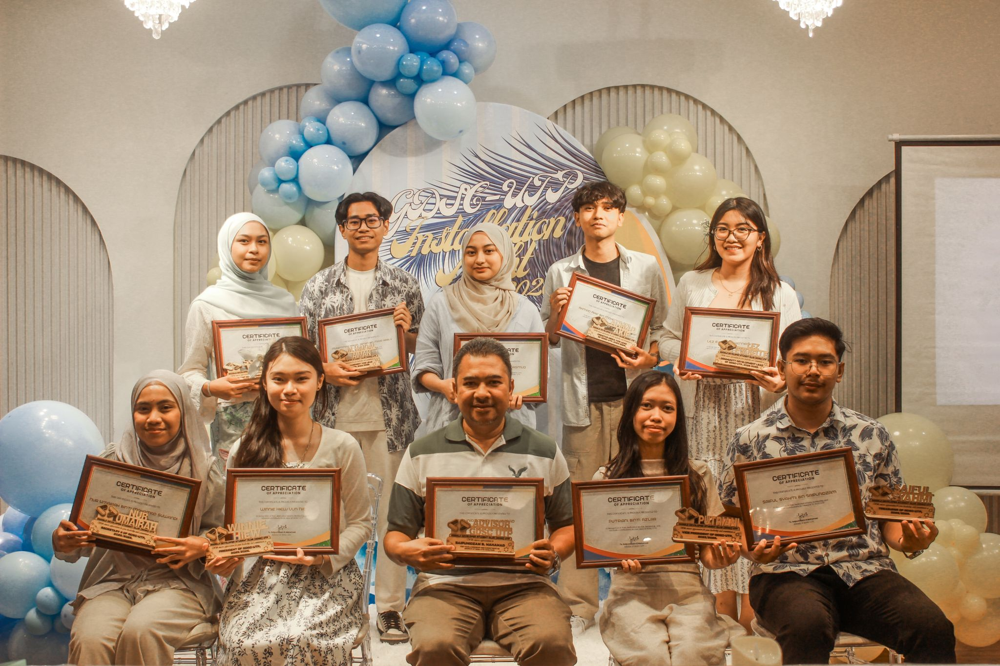
  - Organized club events and taught a Data Analysis Workshop for 15 students [cite: 64, 66].
- **Head of Department @ Regional Conference for Student Activism 2025** 
  - 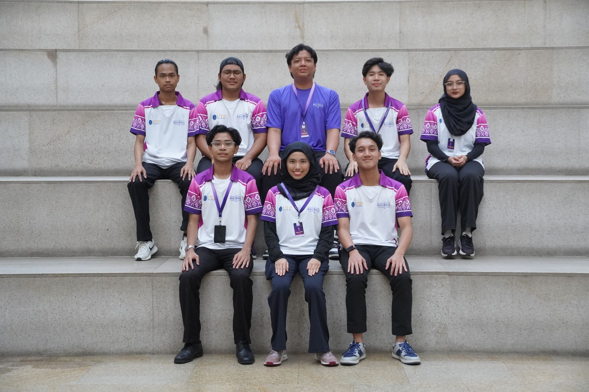[cite: 74, 75]
  - Led media design, increased social media engagement by 15%, and served as videographer/video editor [cite: 76, 77, 78].

## 6. Presentations & Workshops

- **Speaker & Facilitator @ Data Analysis with Python Workshop** (May - June 2024) [cite: 88, 89]
  - 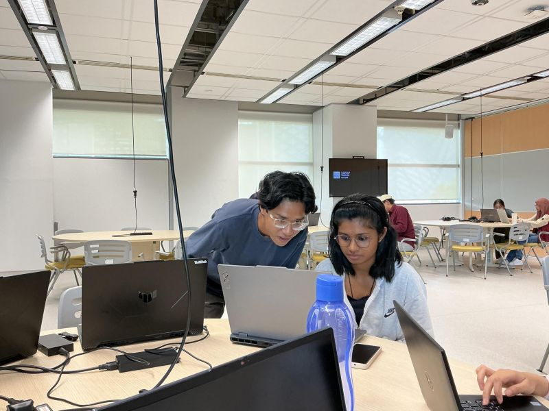
  - Instructed participants on data manipulation using NumPy and Pandas, and guided the creation of Streamlit dashboards [cite: 91, 92].
- **Speaker & Facilitator @ Intro to Web Development Workshop** (Jan 2025) [cite: 93, 94]
  - 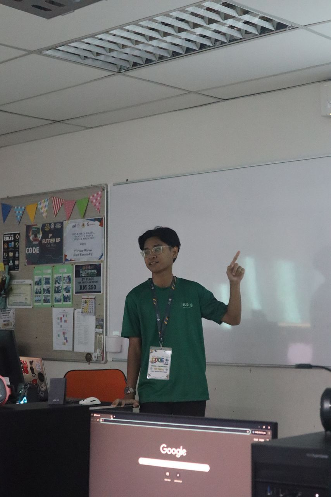
  - Taught HTML, CSS, and JavaScript fundamentals to 34 MRSM students, helping them deploy local websites [cite: 95, 96].

## 7. Hackathons & Achievements

- **1st Place** - Secure Nex Hackathon (2025) [cite: 102, 103]
- **Top 18 Finalist** - Setel Hackathon (2024) [cite: 100, 101]
  - 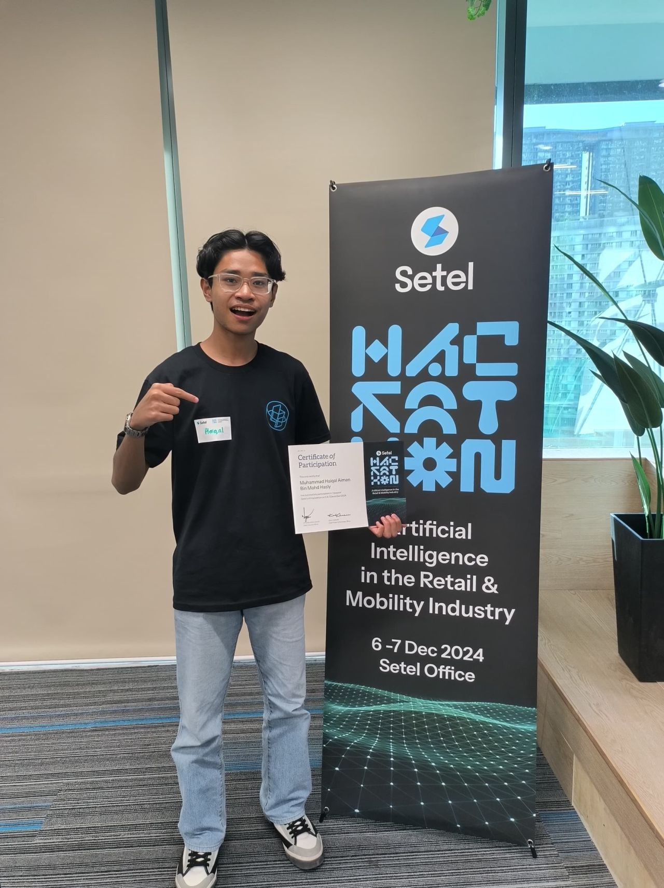
- **5th Place** - Oh, My Code! (2024) [cite: 99, 100]
- **Codexia Competition Winner** [cite: 104]
  - 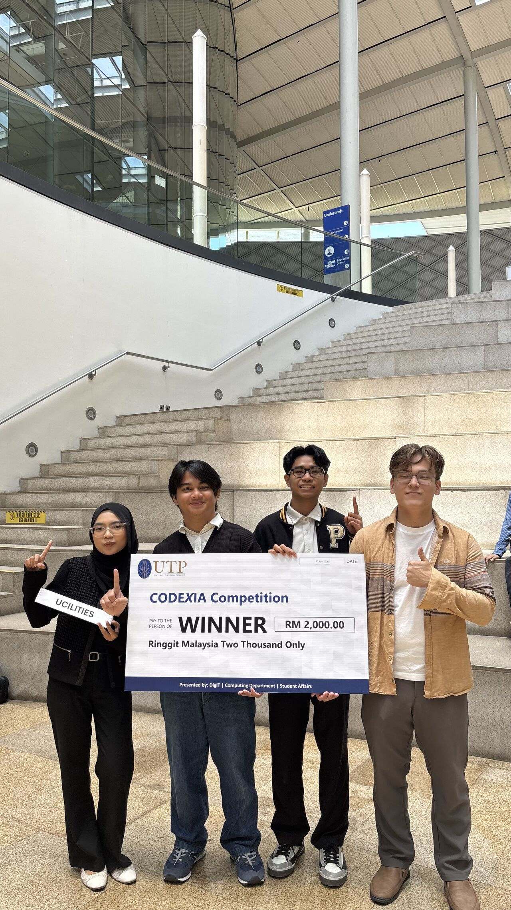
